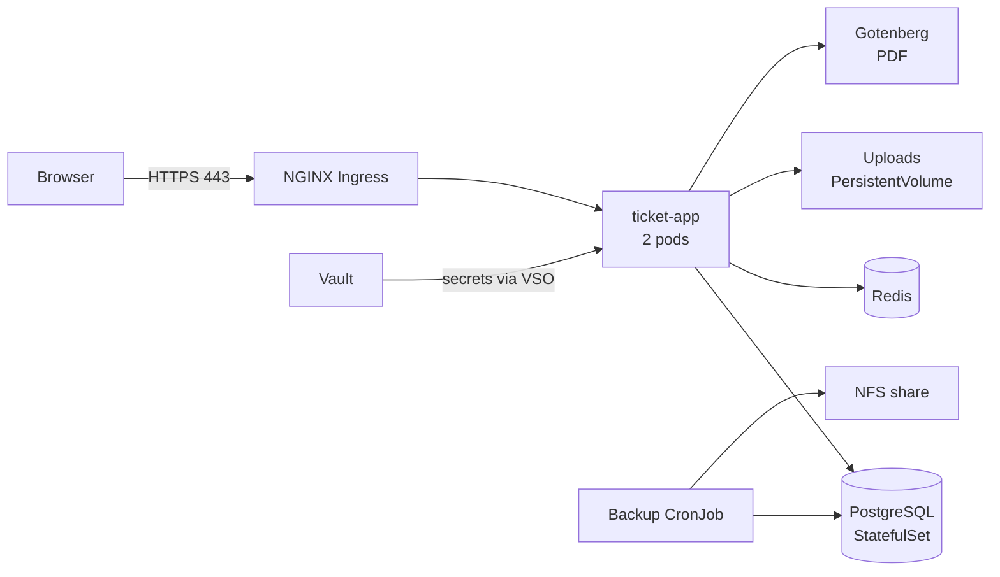
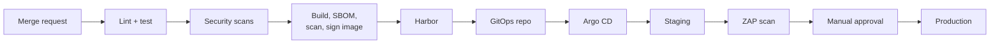

# Architecture

## Tech stack

| Need | Choice | Notes |
| --- | --- | --- |
| Frontend | SvelteKit, adapter-static (SPA) | Built to static files, embedded in the Go binary with `embed` |
| Styling | CSS custom properties from [DESIGN.md](../DESIGN.md) + Svelte scoped styles | No CSS framework |
| Charts | Chart.js | |
| i18n | Paraglide JS | `messages/{en,zh-CN,my,th}.json` |
| Burmese input | myanmar-tools 1.1.3 (pinned: 1.2.0 on npm does not load) | `call()` in `frontend/src/lib/api.ts` converts Zawgyi strings in every JSON write to Unicode (FR-I8); loaded only when a body holds Burmese |
| Backend | Go, stdlib `net/http` (1.22+ routing) | No web framework |
| ORM | GORM + PostgreSQL driver (pgx) | AutoMigrate off in production |
| Migrations | goose | Versioned SQL files |
| Database | PostgreSQL 16 | `pg_trgm` for multilingual search |
| Cache / queue | Redis 7, go-redis | Sessions, rate limits, pub/sub for SSE |
| Realtime | Server-Sent Events + Redis pub/sub | `/api/events` (ticket.view_all). Package `internal/events`: every ticket change publishes `{type, id}` on Redis channel `ticket-events` after commit (no content); each SSE client subscribes, gets a `: ping` every 25 s and is re-authorized at each ping. Clients refetch through the normal endpoints. |
| PDF | Gotenberg (headless Chromium) | Renders the print pages for the report and the activity log: `POST /api/staff/reports/export` or `/api/staff/activity/export` stores the filters under a 60 s one-time token in Redis (key `print:<kind>:<sha256>`, kind report or activity) and asks Gotenberg (`GOTENBERG_URL`) to print `PRINT_BASE_URL/print/<kind>#<token>`; the page reads the data once from `GET /api/print/<kind>` (X-Print-Token) and sets `window.printReady`. Both env vars are optional; without them export answers 503. |
| Auth | Username and password, PBKDF2-SHA256 (Go standard library) | Staff only; no SSO; session ID in HttpOnly cookie, data in Redis |
| Notifications | In-app only | Staff see new and assigned tickets in the queue; no email (decided 2026-09-24) |
| Secrets | HashiCorp Vault + Vault Secrets Operator | App reads env vars; no Vault code in app |

## Data model

| Table | Key columns |
| --- | --- |
| staff | id, name, username, password_hash, must_change_password, password_changed_at, role_id, language, is_active |
| roles | id, name |
| role_permissions | role_id, permission |
| tickets | id, summary, case_details, category_id, priority (null until triage), status, guest_name, employee_id, language, location_id, access_token_hash, assignee_id, first_response_at, resolved_at, created_at, updated_at |
| comments | id, ticket_id, author_staff_id (null = guest), body, is_internal, created_at |
| attachments | id, ticket_id, file_path, media_type (image/video), size_bytes, uploaded_by_staff_id (null = guest), created_at |
| audit_log | id, actor_type (staff, guest or system), actor_staff_id (set only for staff), action, ticket_id (nullable, no foreign key so entries outlive deleted tickets), target, from_value, to_value, ip_address, created_at |
| locations | id, building, floor, line (each JSONB: en, zh-CN, my, th), is_active; unique (building, floor, line) |
| categories | id, name (JSONB: en, zh-CN, my, th), is_active |

Indexes: tickets(status), tickets(created_at), tickets(location_id), trigram index on tickets(case_details).

## Deployment

Ubuntu Server 24.04 LTS, k3s (installed with `--disable traefik`). Namespaces: `ticket-staging`, `ticket-prod`.

| Component | Setup |
| --- | --- |
| Docker image | Multi-stage: Node builds SvelteKit → Go builds static binary → distroless (~20 MB) |
| Registry | Harbor (internal) |
| ticket-app | Deployment, 2 replicas, `/healthz` probes, rolling updates |
| PostgreSQL | StatefulSet + PV; CloudNativePG later if failover needed |
| Migrations | goose Job (image from `deploy/migrate.Dockerfile`) as Argo CD Sync hook in wave 1: after PostgreSQL (wave 0), before the app Deployment (wave 2) |
| Uploads | PV, start 200 GB; NFS (ReadWriteMany) when multi-node |
| NGINX | F5 NGINX Ingress Controller (community ingress-nginx retired March 2026 — verify); `client_max_body_size 100m`; allow/deny company network; `proxy_buffering off` + 1 h read timeout on `/api/events` |
| Redis | 1 replica, password from Vault, `appendonly yes` on small PV |
| Gotenberg | 1 replica, ClusterIP only, ~512 MB memory; the app sets `GOTENBERG_URL` to its service and `PRINT_BASE_URL` to the app's own ClusterIP service URL, which Gotenberg's Chromium must be able to reach |
| Vault | hashicorp/vault Helm chart, Raft storage, 1 pod (3 for HA); Kubernetes auth; file audit device; Shamir unseal 3 of 5 |
| TLS | Company CA cert as Ingress Secret, or cert-manager / Vault PKI |
| Backups | Nightly CronJob: pg_dump + uploads → NFS |
| Manifests | Kustomize, in GitOps repo watched by Argo CD |
| Firewall (ufw) | 443 open to users; 6443 admins only |

## CI/CD and DevSecOps

GitHub Actions checks every pull request and push (.github/workflows/ci.yml); after CI passes on `main`, .github/workflows/cd.yml builds, scans, signs and pushes the images and commits their digests to the staging overlay. Argo CD deploys by pulling those manifests, so CI never holds cluster credentials.

Interim, until the platform exists (2026-09-28): images go to GHCR instead of Harbor, Cosign signs keyless with the workflow's GitHub OIDC identity instead of a key in Vault, the GitHub token replaces Vault JWT auth, the staging digests live in this repo's `deploy/overlays/staging` instead of a separate GitOps repo, and there is no ZAP stage until staging is up.

| Stage | Tools | Fails when |
| --- | --- | --- |
| Lint | gofmt, golangci-lint, svelte-check | Any error |
| Unit tests | `go test -race -coverpkg=./...` against PostgreSQL and Redis service containers | Test fails or Go coverage < 70% |
| i18n check | Script comparing message keys | Any language missing a key from en.json |
| End-to-end | Playwright (Edge) against the Go binary serving the built SPA, with Gotenberg; one retry | A test fails twice |
| Secret scan | Gitleaks | Secret in code or history |
| SAST | Semgrep | High-severity finding |
| Dependencies | govulncheck, Trivy fs | Known vuln with fix available |
| IaC | Trivy config, kube-linter | Root, no limits, privileged |
| Build | Docker Buildx | Build error |
| SBOM | Syft (SPDX JSON, attached to the image as a Cosign attestation) | — |
| Image scan | Trivy image, before the push | HIGH/CRITICAL with fix |
| Sign | Cosign (interim: keyless, GitHub OIDC; later key in Vault) | Signing fails |
| DAST | OWASP ZAP baseline on staging | High-risk alert |

Release flow:

- `main` protected; pull request needs passing checks + 1 approval.
- Merge to `main` → staging automatically.
- Tag `vX.Y.Z` → production after manual approval in Argo CD.
- Rollback: revert image tag in GitOps repo.
- CI gets secrets from Vault via GitHub Actions OIDC tokens (JWT auth).
- Kyverno: only Cosign-signed Harbor images, no root, CPU/memory limits required.
- Harbor nightly rescan; Renovate weekly update pull requests.
