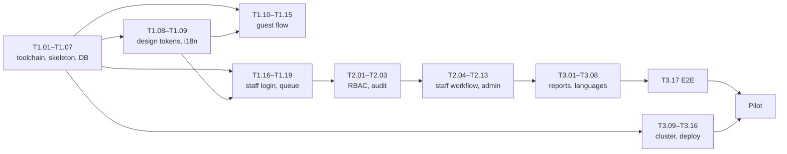

# Plan

MVP in 3 weeks, pilot in week 4. Later features only when users ask.

Tasks are listed in build order: `/next-task` picks the first unchecked one. Each task names its size, the tasks it depends on, the requirement IDs it covers, and when it counts as done.

Size: **S** up to 2 hours · **M** half a day · **L** one day. Agent: **be** = go-backend, **fe** = svelte-frontend, **ops** = done by hand or with deploy rules.

Cluster work (T3.09–T3.16) depends only on the skeleton and Dockerfile, so an ops person can start it in week 1 in parallel.

## Phase 1 — Week 1: foundations

- [x] **T1.01** Dev toolchain — S · deps: none · ops
    - Install Go 1.23+, Node 22 LTS or newer, Docker Desktop, goose, golangci-lint, make.
    - Done when: `go version`, `node -v`, `docker compose version`, `goose -version` all work.
    - Status: Go 1.27.1, Node 24, goose 3.28.0, golangci-lint 2.13.2, make 4.4.1 installed per user. Docker Desktop installed by IT; Docker Compose v5.5.1.
- [x] **T1.02** Repo skeleton — M · deps: T1.01 · be + fe
    - `backend/` Go module with `cmd/ticket-app/main.go` serving `GET /healthz`; `frontend/` SvelteKit with adapter-static; root Makefile (`dev`, `test`, `lint`, `build`); `.gitignore`, `.editorconfig`.
    - Done when: `make dev` serves the SvelteKit page and `/healthz` returns 200. Fill in "Commands" in CLAUDE.md.
- [x] **T1.03** Local services — S · deps: T1.02 · ops
    - `docker-compose.yml` with PostgreSQL 16, Redis 7, Gotenberg; `.env.example` with every variable.
    - Done when: `docker compose up` starts all three and the app connects.
    - Status: all three services healthy (PostgreSQL 16.15, Redis PONG, Gotenberg up). App connection is proven in T1.07.
- [x] **T1.04** Config loading — S · deps: T1.02 · be · NFR-7
    - Read DB, Redis, OIDC, SMTP, upload dir, base URL from env; fail at startup with a clear message when one is missing.
    - Done when: unit test covers missing and valid config.
- [x] **T1.05** Database migrations — M · deps: T1.03 · be · FR-L2
    - goose SQL for all 9 tables, foreign keys, indexes, `pg_trgm`, and the grant that gives the app user INSERT and SELECT only on `audit_log`.
    - Done when: `goose up` and `goose down` both run clean, and an UPDATE on `audit_log` as the app user fails.
    - Status: done. Security review added: no UPDATE on comments (an internal note can never turn public, FR-G5) and a DB trigger keeping staff.create and role.manage on Root Admin only (FR-A3). Still app-layer: last-Root-Admin protection (T2.08).
- [x] **T1.06** Seed data — S · deps: T1.05 · be
    - Default roles and permissions from docs/REQUIREMENTS.md, 5 default categories in 4 languages, sample locations (dev only).
    - Done when: `make seed` fills an empty dev DB and is safe to run twice.
    - Status: roles, permissions and categories are production data, so they are migration 00002 (runs everywhere). `make seed` adds 8 dev sample locations (2 buildings x 2 floors x 2 lines). Category and location translations are drafts for native review in T3.07.
- [x] **T1.07** GORM models and DB layer — M · deps: T1.05 · be
    - Models for all tables; connection pool; `audit.Record(tx, actor, action, ...)` helper used inside the same transaction as each change (FR-L1); one repository test per table against the compose DB.
    - Done when: `go test ./...` passes with the DB running, and a test shows a failed audit write rolls back the change.
    - Status: done. Security review fixes: Ticket and Comment refuse json.Marshal (handlers must use response types), GORM logs parameterized SQL through slog, audit.Record rejects a non-transaction handle and a staff actor without ID.
- [x] **T1.08** Design tokens and base components — L · deps: T1.02 · fe
    - `tokens.css` from DESIGN.md, self-hosted Noto fonts, per-language line-height rules, root layout; components: Button (4 variants), TextInput, Select, Card, Badge (status, priority), Alert, Toast.
    - Done when: a `/dev/components` page shows every component and passes an axe accessibility check.
- [x] **T1.09** i18n setup — S · deps: T1.02 · fe · FR-I1, FR-I2
    - Paraglide with `en` (other 3 files present with English placeholders), `lang` on `<html>`, language switcher with cookie.
    - Done when: `node scripts/check-i18n.mjs` passes and the switcher changes `lang`.
- [x] **T1.10** Public lookup API — S · deps: T1.07 · be
    - `GET /api/locations` (building → floor → line tree) and `GET /api/categories`, names in the requested language.
    - Done when: handler tests cover language fallback to English.
- [x] **T1.11** Create ticket API — M · deps: T1.07 · be · FR-G1, FR-T2–T4, NFR-2, FR-L1
    - `POST /api/tickets`: validate fields, build summary, create 32-byte token and store only its SHA-256 hash, write `ticket.created` to audit_log in the same transaction.
    - Done when: tests cover every validation rule and confirm the raw token is never stored.
    - Status: done. Security review: hidden-character rules added (control, bidi, zero-width-only values). Accepted: location active check is not row-locked, so a ticket can attach to a location deactivated in the same instant (data only, no access issue).
- [x] **T1.12** Evidence upload API — M · deps: T1.11 · be · FR-T1, NFR-5
    - One file per request; type detected from content; 10 MB image / 100 MB video / 5 files per ticket; saved under the upload dir with a random name.
    - Done when: tests reject a renamed `.exe`, an oversize file and a 6th file.
    - Status: done. POST /api/tickets/{id}/attachments with X-Tracking-Token. Security review: count checked before any disk write, status re-checked under the row lock.
- [x] **T1.13** Guest ticket form UI — L · deps: T1.08, T1.09, T1.10, T1.12 · fe
    - Fields per REQUIREMENTS §2, cascading building → floor → line, file-drop with camera capture and previews, inline errors, sticky submit bar on mobile.
    - Done when: a ticket with a photo and a video can be submitted from a phone-sized screen.
    - Status: done. Playwright e2e at 390x844 submits with a JPEG and an MP4 (DB shows image,video); inline errors; oversize file refused in the browser; axe 0 violations in en and my. The native file button is hidden (it shows the browser language) and the dashed box opens the picker. No `capture` attribute, so guests can pick from the gallery too.
- [x] **T1.14** Tracking card — S · deps: T1.13 · fe · FR-G2
    - Ticket number, tracking link with copy button, QR code. Ask before adding a QR library.
    - Done when: the link copies and the QR code opens the tracking page on a phone.
    - Status: done with the qrcode library (chosen by the user). e2e checks the link format, clipboard copy and that the QR SVG encodes exactly the link. The /track page it opens is T1.15; re-check the QR on a real phone then.
- [x] **T1.15** Tracking page — M · deps: T1.11 · be + fe · FR-G3–G5
    - `GET /api/track/{token}`: status, public replies, evidence; guest reply and "Confirm fix"; internal notes never returned.
    - Serving evidence: set Content-Type from the stored media_type, add `X-Content-Type-Options: nosniff`, and never use the sniffed or client type (a file can be a valid JPEG header followed by script). Same rule for T1.19.
    - Done when: tests prove internal notes are absent and a wrong token returns 404.
    - Status: done. Link is /track#<token> (after "#", so it never reaches server logs or Referer); API takes the token in X-Tracking-Token. Endpoints: GET /api/track, POST /api/track/comments (reply reopens waiting/resolved), POST /api/track/confirm (resolved only), GET /api/track/attachments/{id} (strict type, nosniff, sandbox CSP, no-store). Guest view omits guest name, employee ID and staff names. Security review done inline (reviewer agent stalled twice): 1 low fixed (malformed link).
- [x] **T1.16** Staff SSO login — L · deps: T1.04, T1.07 · be · FR-R1, FR-A2
    - OIDC with Entra ID, login only for emails in `staff` and `is_active`, session in Redis, HttpOnly cookie, logout. Dev mode: local OIDC mock so work is not blocked by SSO access.
    - Done when: an unknown email is refused and `login.success` / `login.failed` are audited.
    - Status: done with go-oidc v3 + x/oauth2 and go-redis v9 (chosen by the user). Endpoints: GET /api/auth/login, GET /api/auth/callback, POST /api/auth/logout, GET /api/auth/me. State cookie + one-time Redis state (login CSRF), PKCE S256, nonce; session ID 128 bits, Redis key is its SHA-256, 8 h TTL, HttpOnly + SameSite=Lax (+ Secure on https). requireStaff re-reads the staff row on every request (NFR-9). login.failed uses actor "guest" (no staff ID). Dev IdP: `make dev-oidc` (backend/cmd/dev-oidc, never in the image); dev staff root@, agent@, viewer@dev.test from `make seed`. /login and /staff pages. Security review: 3 low/info; BASE_URL must now be https off localhost; tenant-pinned issuer documented.
- [x] **T1.17** create-root-admin command — S · deps: T1.07 · be · FR-A6
    - `ticket-app create-root-admin --email <email>`; refuses if a Root Admin already exists unless `--force`.
    - Done when: test covers first run and second run.
    - Status: done. Optional `--name` (default: the email). Advisory lock against two runs at once; staff.created audited with actor "system" in the same transaction; an existing email is refused even with --force.
- [x] **T1.18** Queue — L · deps: T1.08, T1.16 · be + fe
    - `GET /api/staff/tickets` with filters (status, priority, assignee), trigram search by employee ID and text, pagination; data-table UI, stacked cards on mobile.
    - Done when: filters combine correctly and a Thai or Burmese phrase in case details is found.
    - Status: done. Filters repeat (`status=new&status=waiting`), priority `none` = not triaged, assignee `me`/`none`/ID, `q` = case details (ILIKE, wildcards escaped, trigram index), employee ID (any case) or `#id`; page_size up to 100, page up to 1000, at most 10 values per filter. A minimal `require(permission)` guards it now (one DB query; T2.01 adds caching and the role table test). /staff queue keeps filters in the URL (default: open = new, in progress, waiting); table from 768px, cards on phones. Tests: filter combinations, Thai and Burmese phrases, 403 without ticket.view_all; e2e finds a Thai ticket on phone and desktop, axe 0 violations. Security review: 1 low + 1 info fixed (page and repeat caps).
- [x] **T1.19** Ticket detail (read-only) — M · deps: T1.18 · be + fe
    - Thread, details card, evidence viewer (image lightbox, video player).
    - Done when: page matches DESIGN.md ticket-detail layout on desktop and mobile.
    - Status: done. GET /api/staff/tickets/{id} (staff view: guest name, employee ID, internal notes with authors; no token hash) and GET /api/staff/tickets/{id}/attachments/{file} (same safe headers as the guest route); both need ticket.view_all. DESIGN.md "App adaptation" gained "Staff queue" and "Ticket detail" layouts (the new DESIGN.md had none). /staff/tickets/[id]: two columns from 1024px with sticky Details, one column with Details first below; image lightbox on a native modal dialog; internal notes dashed and tagged. e2e at 390px and 1280px: axe 0 violations, lightbox opens and closes with Esc. Security review: no findings.
- [x] **T1.20** Dockerfile — S · deps: T1.02 · ops
    - Multi-stage: Node builds SvelteKit, Go embeds it and builds a static binary, distroless final image, non-root user.
    - Done when: `docker run` serves the app and the image is under 40 MB.
    - Status: done. Image 33.6 MB (was 43.9 MB: a woff2-only Vite plugin drops the legacy .woff fonts, and the unused 700 weight became the 500 the caption token uses). `docker run` on the compose network: /healthz 200, SPA routes, /api/locations in Thai, 401/404 JSON, user nonroot, `create-root-admin` runs inside the image.
- [x] **T1.21** CI pipeline, part 1 — M · deps: T1.20 · ops
    - Lint, unit tests with coverage gate, i18n check, Gitleaks, Semgrep, govulncheck, Trivy filesystem scan.
    - Done when: a merge request with a planted test secret fails the pipeline.
    - Status: done. On GitHub, the pull request from ci/t1-21-planted-secret failed CI when Gitleaks found its fake token (github-pat, exit code 1), and the branch was then deleted unmerged. See [note](notes/T1.21.md).

## Phase 2 — Week 2: staff workflow

- [x] **T2.01** RBAC middleware — M · deps: T1.16 · be · FR-R2, FR-R3
    - Permission constants, `require("<permission>")` middleware, role changes apply on the next request.
    - Done when: table test checks every permission against every default role.
    - Status: done. `internal/rbac` holds the 11 permission constants and `All`; staff routes and the migrations test use them. No permission cache: `require` reads the role's permission from the DB on every request (after `requireStaff` reads the staff row), so a revoked permission or a new role applies at once and there is nothing to invalidate. Tests: `TestRequire_FRR2` (5 default roles × 11 permissions, plus 401 without a session) and `TestRequireRoleChange_FRR3` (permission removed gives 403, moving the staff member to Admin gives 200, same session). Security review: no findings.
- [x] **T2.02** Audit coverage check — S · deps: T2.01 · be · FR-L1
    - A test that calls every mutating endpoint and asserts it wrote the matching audit_log row; new endpoints without an audit row fail the build.
    - Done when: the test passes for all phase 1 endpoints.
    - Status: done. `Routes` takes any `HandleFunc` registrar, so `TestAuditCoverage_FRL1` lists the real routes with `routeRecorder` (T2.03 can reuse it). Every non-GET route needs a case or an exemption with a reason; stale entries fail too. Cases call the endpoint and look for the audit row by action plus ticket_id or target: POST /api/tickets, attachments, track comments (also the reopen status change), track confirm, and GET /api/auth/callback (login.success, login.failed). Exempt: POST /api/auth/logout (Redis session only). The route check needs no DB, so plain `go test` also catches a new unaudited route; a planted `POST /api/zz` failed with "no audit case (FR-L1)". Security review inline: only the `Routes` parameter type changed in production code, no findings.
- [x] **T2.03** Protect existing staff endpoints — S · deps: T2.01 · be
    - Apply `require()` to every `/api/staff/*` route; a route test fails the build if a new staff route has no permission.
    - Done when: a Viewer gets 403 on every write endpoint.
    - Status: done, test only: the 3 staff routes already used `require(ticket.view_all)`. `TestStaffRoutes_FRR3` lists every `/api/staff/` route with `routeRecorder` (wildcards filled with 1) and checks: no session gives 401; a role with no permissions gives 403 `auth.forbidden`; every non-GET route gives a Viewer 403 (no staff write routes exist yet, so this guards T2.04 on). A planted `GET /api/staff/zz` behind `requireStaff` only failed with "role without permissions = 200". Shared `newRole()` test helper. Needs DB and Redis (runs in make test and CI). Security review inline (test-only change): no findings.
- [x] **T2.04** Ticket actions API — M · deps: T2.02, T2.03 · be · FR-T3, FR-T5
    - Status (only lifecycle transitions allowed), assign (Agent: self only), priority, category; each audited with old and new value; sets `resolved_at`.
    - Done when: tests cover every allowed and rejected transition.
    - Status: done. `PATCH /api/staff/tickets/{id}` (ticket.update) takes status, priority and category_id; `PUT /api/staff/tickets/{id}/assignee` (ticket.assign) takes assignee_id or null. Both return 204 and run under the ticket row lock. Each changed field writes its own audit row with old and new value (ticket.status_changed, priority_changed, category_changed, assigned). All fields are validated before any write. Setting a field to its current value writes nothing. Errors: 409 `ticket.bad_transition`, 403 `ticket.assign_self_only`, 404 `ticket.not_found`, 400 `invalid_body` or `validation`. Moving to Resolved sets `resolved_at` from the DB clock; reopening clears it. Tests: all 25 status pairs, 16 triage cases, 10 assign cases, 3 not-found cases, and both routes in the audit and route tests. Security review: no findings.
    - Decisions made while the user was away, easy to reverse: staff may move new→in_progress, in_progress→waiting/resolved, waiting→in_progress and resolved→in_progress. Only the guest confirm and the auto-close job close a ticket (FR-T5). Assigning does not change the status. Agent self-only is checked by the role name "Agent" (a `ponytail:` note in actions.go); a custom role with ticket.assign can assign anyone. Priority and category can still change on a closed ticket.
- [x] **T2.05** Replies and internal notes API — S · deps: T2.02 · be · FR-T6
    - Staff public reply, internal note, guest reply via token; first staff reply sets `first_response_at`.
    - Done when: guest endpoints never return internal notes (test).
    - Status: done. `POST /api/staff/tickets/{id}/comments` (ticket.comment) takes `{"body", "internal"}` and returns 201 with the staff comment. It runs under the row lock and audits `comment.added`, with To set to public or internal. The first public reply sets `first_response_at`; internal notes never do (a note is not a response to the guest). A closed ticket gives 409 `ticket.closed`, and the status never changes. The guest reply via token was already built in T1.15. `TestStaffComment_GuestView_FRG5` checks the guest response bytes: no note text, no "internal" and no staff name. Staff detail shows both. Security review: no findings.
- [x] **T2.06** Ticket detail actions UI — L · deps: T1.19, T2.04, T2.05 · fe · FR-L3
    - Action controls shown only when permitted, reply box with Public / Internal toggle, internal note styling, ticket timeline.
    - Done when: timeline shows who moved the ticket to In Progress and who closed it.
    - Status: done.
        - Backend: the staff detail response gains `timeline` (audit rows for the ticket with actor type and name, from/to as display values, never IP or target) and `category_id`. New `GET /api/staff/assignees` (ticket.assign) lists active staff.
        - Frontend: the Details card gets status (allowed moves only), priority, category and assignee controls, each shown only with its permission. One Save button, because on Windows arrow keys on a closed select fire change. Agents see only "Assign to me". A reply box offers Public reply or Internal note (hidden on closed tickets and without ticket.comment), plus a Timeline card. DESIGN.md "Ticket detail" gained Action controls, Reply box and Timeline card specs. 32 message keys, English placeholders in zh-CN, my and th. Also fixed check-i18n, which found no files when run from frontend/.
        - Tests: `TestStaffTicket_Timeline_FRL3`, `TestStaffAssignees_FRT3`. The e2e test staff-actions.spec.ts: an agent works a ticket through the UI and the guest confirms; the timeline shows the agent on In Progress and "Guest" on Closed. The Viewer sees no controls. axe finds 0 violations. 23/23 e2e pass.
        - Security review: no findings.
        - Decision: the ticket timeline is visible with ticket.view_all; the activity log page (T3.06) keeps audit.view.
- [x] **T2.07** Auto-close job — S · deps: T2.04 · be · FR-T5
    - Hourly job closes tickets Resolved for 7 days, actor "system"; Redis lock so only one pod runs it.
    - Done when: test with a fake clock closes the right tickets once.
    - Status: done. `internal/autoclose.Run(ctx, db, redis, now)`: `SET autoclose:lock NX EX 3300` (never released early, so pods ticking at other minutes skip the hour), then one transaction per ticket with a row lock and a re-check (a guest reopen wins), and the audit row `ticket.auto_closed` with actor system. main.go runs it at startup and hourly with recover(), so a panic skips the hour instead of killing the server. The timeline shows `ticket.auto_closed` (new message key, English placeholders). Tests with the fake clock at 2001, so real tickets are never touched: resolved 8 days ago and exactly 7 days ago close; 6 days 23 hours ago, in progress, and closed stay; a second run closes 0 with no new audit rows; a held lock changes nothing. Security review: 1 medium fixed (no recover in the goroutine).
- [x] **T2.08** Staff accounts API — M · deps: T2.03 · be · FR-A1–A5
    - Create (Root Admin only), deactivate, set role; last Root Admin protected; Admin cannot grant Root Admin.
    - Done when: tests cover all five FR-A rules.
    - Status: done.
        - Routes: `GET /api/staff/accounts` (staff.manage); `POST /api/staff/accounts` (staff.create: name, email, role_id; email lowercased, `ON CONFLICT` on lower(email) gives 409 `staff.email_taken`); `PATCH /api/staff/accounts/{id}` (staff.manage: role_id, is_active).
        - Root Admin role: found by holding role.manage, not by name. Giving it, or changing a Root Admin's account in any way, needs a caller who is Root Admin; the caller is checked again after the lock (403 `staff.root_admin_only`, FR-A4). The last active Root Admin cannot be demoted or deactivated (409 `staff.last_root_admin`, FR-A5), under the create-root-admin advisory lock, so two changes at once cannot both pass.
        - Audit: staff.created, staff.role_changed (old and new role name), staff.deactivated, staff.reactivated. Reactivation was a decision made while the user was away, so mistakes can be undone.
        - Tests: FRA1 (13), FRA2 (sign in, then 401 and no sign-in after deactivation), FRA3, FRA4 (14), FRA5 (5, run in a rolled-back transaction so root@dev.test is never touched in committed data); both write routes are in the audit coverage test.
        - Security review: no findings.
- [x] **T2.09** Roles API — S · deps: T2.08 · be · FR-A3
    - Create role, set permissions; `staff.create` and `role.manage` cannot be added to any role except Root Admin.
    - Done when: test proves an Admin cannot raise their own access.
    - Status: done.
        - Routes: `GET /api/staff/roles` (staff.manage, for the role pickers: id, name, root, permissions, staff_count); `POST /api/staff/roles` (role.manage: name and permissions); `PUT /api/staff/roles/{id}/permissions` (role.manage: replaces the set, under a row lock).
        - staff.create and role.manage on any other role: 400 `root_only` (the DB trigger stays as the backstop). The Root Admin role cannot be edited (403 `role.root_fixed`), so nobody can remove role.manage and lock every account out. Unknown permissions and a PUT without `permissions` are refused. A duplicate name gives 409 `role.name_taken`.
        - Audit: role.created and role.changed (From = permissions removed, To = permissions added).
        - Tests: `TestAdminCannotRaiseOwnAccess_FRA3` (4 refused attempts, then permissions, roles and audit unchanged), TestRoleCreate (13), TestRolePermissions (11), TestRoleList_FRR2, TestRoleChangeNextRequest_FRR3.
        - Security review: no findings.
        - Note: the DB trigger finds Root Admin by name and the API by role.manage. Both agree while roles cannot be renamed; add a check if a rename is ever built.
- [x] **T2.10** Admin UI: staff and roles — L · deps: T2.08, T2.09 · fe
    - Staff list with create / deactivate / role; role editor as a permission grid.
    - Done when: every action is visible only to roles that can use it.
    - Status: done.
        - Pages: /staff/admin/staff and /staff/admin/roles, reached from the account menu (staff.manage only; no nav bar per DESIGN.md).
        - Staff: a table from 1024px, cards below. The create form shows only with staff.create. Per row: role select + Save and Deactivate/Reactivate with a native `<dialog>` confirm. The Root Admin option and all controls on a Root Admin's row show only with role.manage. Deactivated accounts sit behind a "Show deactivated (n)" checkbox.
        - Roles: a permission grid, read-only with staff.manage and editable with role.manage, plus a "New role" form. The Root Admin role is read-only; staff.create and role.manage are disabled on other roles with a hint (FR-A3).
        - Also: Select gained `hideLabel` for table cells; 65 message keys, English placeholders; DESIGN.md gained an account-menu bullet and "Staff accounts" and "Roles" sections.
        - e2e admin.spec.ts: the Root Admin creates an Admin and edits roles; the new Admin sees role controls but no create form, no Root Admin option, no controls on root's row and a read-only grid; the Agent sees no admin links and gets forbidden. axe clean at both sizes. 25/25 e2e pass.
        - Security review inline: UI only, and the API checks every action (T2.08, T2.09); no findings.
        - Known issue: the Go DB tests leave deactivated staff behind (272 in the dev DB), because `newStaff` can only deactivate rows that audit_log points at. It is harmless, but it slowed the admin page until deactivated accounts were hidden. Fix later by running those tests in `e.isolated()` transactions.
- [x] **T2.11** Admin: categories and locations — M · deps: T2.03 · be + fe · FR-I4
    - CRUD with one field per language; deactivate instead of delete.
    - Done when: a new line appears in the guest form dropdown in all 4 languages.
    - Status: done. /staff/admin/lookups lets category.manage staff add, rename and deactivate categories and locations with names in all 4 languages, audited; a new line shows in the guest form in every language. See [note](notes/T2.11.md).
- [x] **T2.15** Username and password sign-in replaces SSO — L · deps: T1.16, T1.17, T2.08, T2.10 · be + fe · FR-R1, FR-A1, FR-A2, FR-A6–FR-A11, NFR-9
    - Decided 2026-09-24: SSO removed fully; sign in with a username; email kept as an optional field for notifications only (T2.12); temporary password changed at first sign-in; only Root Admin resets passwords.
    - DB (migration 00003): `staff` gains `username` (unique on lower), `password_hash`, `must_change_password`, `password_changed_at`; `email` becomes optional (unique when set). Existing rows get `username = lower(email)` and no password: Root Admin resets them, or `create-root-admin --force` adds a Root Admin who can.
    - Hash: stdlib `crypto/pbkdf2` SHA-256, 600,000 iterations, 16-byte salt, stored as `pbkdf2-sha256$<iter>$<salt>$<hash>` so the count can rise later. Unknown usernames are checked against a dummy hash (same timing).
    - API:
        - `POST /api/auth/login {username, password}` (JSON only, against login CSRF): cookie + `{must_change_password}`; 401 `auth.invalid` for every failure; 429 `auth.too_many_attempts` (FR-A11). Audits login.success / login.failed with the username.
        - `POST /api/auth/password {current_password, new_password}`: clears the flag, ends other sessions, issues a new cookie, audits staff.password_changed.
        - `POST /api/staff/accounts {name, username, email?, role_id, password}`: password is temporary.
        - `PUT /api/staff/accounts/{id}/password {password}` behind `require(staff.create)`: new temporary password, ends that person's sessions, audits staff.password_reset.
        - `requireStaff`: with must_change_password set, only me, password and logout pass (403 `auth.password_change_required`); a session issued before `password_changed_at` is refused (FR-A10).
        - `GET /api/auth/me` returns username and must_change_password. Session cookie becomes SameSite=Strict.
    - CLI: `ticket-app create-root-admin --username <u> [--name] [--email] [--force]` prints a generated temporary password once.
    - Frontend: /login form (username, password); /staff/password (forced, and in the account menu); admin staff page gets username, optional email, temporary password and a Root Admin-only "Reset password" action; keys in all 4 message files.
    - Remove: internal/auth/oidc.go, oidcmock, cmd/dev-oidc, `make dev-oidc`, OIDC_* env, Playwright dev-oidc server, go-oidc and x/oauth2 deps. Dev staff get a known dev password from `make seed` (documented in CLAUDE.md).
    - Done when: Go tests prove FR-A2 (same 401 for unknown, wrong, inactive), FR-A8 (403 until changed), FR-A10 (old session refused after reset), FR-A11 (6th failure gets 429) and FR-A6 (printed password signs in, then must change); e2e signs in with username and password and completes a forced change; no `oidc` left in backend, frontend, Makefile or .env.example; security-reviewer has no open findings.
    - Status: done. Staff sign in with username and password (PBKDF2, temporary passwords with forced change, Root Admin reset, Redis login limit, sessions end on password change); SSO removed except the OIDC lines left in .env.example. See [note](notes/T2.15.md).
- [x] **T2.12** Staff email notifications — M · deps: T2.04 · be
    - Redis queue, worker goroutine, SMTP; on new ticket and on assignment. Skip if the open question decides in-app only.
    - Done when: a stopped SMTP server delays emails without failing the request.
    - Status: skipped. The user decided on in-app only (2026-09-24): staff see new and assigned tickets in the queue, and no email is sent. See [note](notes/T2.12.md).
- [x] **T2.13** Guest rate limit — S · deps: T1.11 · be · NFR-3
    - 5 tickets per IP per 10 minutes, counted in Redis.
    - Done when: the 6th request returns 429 with a translated message code.
    - Status: done. POST /api/tickets counts each request per IP in Redis (default 5 per 10 minutes, GUEST_TICKET_LIMIT), the 6th gets 429 ticket.rate_limited and /report shows a translated message. See [note](notes/T2.13.md).
- [x] **T2.14** Security review, phases 1–2 — S · deps: T2.01–T2.13, T2.15 · security-reviewer
    - Review auth, RBAC, audit, guest endpoints and uploads.
    - Done when: every finding is fixed or recorded as accepted in this file.
    - Findings (5 review passes: guest endpoints, uploads, RBAC and audit, staff admin and DB, auth):
        - Fixed, medium: the server had only a header timeout. Now ReadTimeout 1 min and IdleTimeout 2 min; evidence uploads extend their own read deadline to 15 min after the token check (TestServerTimeouts, TestUploadOutlastsReadTimeout_FRT1).
        - Fixed, medium: no security headers. Every response now gets nosniff, X-Frame-Options DENY, Referrer-Policy no-referrer and a CSP with frame-ancestors, object-src, base-uri and form-action (TestSecurityHeaders).
        - Accepted: no script-src or style-src in the CSP yet. The SvelteKit build bootstraps with an inline script, so a script policy needs kit.csp hashes and a full e2e run. Moved to T3.17.
        - Accepted, medium: Agent "self only" assignment is keyed to the role name "Agent" (T2.04 decision, awaiting human review); a custom role given ticket.assign may assign anyone. Root Admin alone decides which roles get ticket.assign.
        - Accepted, low: /api/track/* has no rate limit. The token is 256 bits, so guessing is out; flooding with a valid token only hits that one ticket. Add an NGINX request limit in T3.10.
        - Not a defect: "a successful sign-in refunds other users' failures from the same IP". The success takes back only its own attempt (TestLogin_SuccessDoesNotRefundIP_FRA11).
        - Staff admin, queue and DB grants: no findings.
    - Status: done. Two medium findings fixed, three accepted with reasons above, one shown not to be a defect. See [note](notes/T2.14.md).

## Phase 3 — Week 3: reports, languages, deploy

- [x] **T3.01** Reports API — L · deps: T2.04 · be · FR-P1, FR-P2
    - Summary card values with previous-period change, all 7 graph datasets, filters (date range, building, category); medians in SQL.
    - Done when: tests with fixed seed data return known numbers.
    - Status: done. GET /api/staff/reports (report.view) returns 7 cards with previous-period values and all 7 datasets. Open, unassigned and urgent are counted as of the period end, rebuilt from audit_log. Tests with fixed 2020 data match exact numbers. See [note](notes/T3.01.md).
- [x] **T3.02** Written summary — S · deps: T3.01 · be + fe · FR-P1, FR-I6
    - Sentence templates as message keys in 4 languages, filled from report data.
    - Done when: summary reads correctly in all 4 languages.
    - Status: done. `writtenSummary(report)` builds up to 6 sentences from `summary_*` message templates (English plurals via Paraglide variants, draft zh-CN/my/th translations) with Intl-formatted numbers, dates and durations; WrittenSummary shows them, checked in all 4 languages by e2e. See [note](notes/T3.02.md).
- [x] **T3.03** Dashboard UI — L · deps: T1.08, T3.01 · fe
    - KPI cards linking to the filtered queue, written summary, Chart.js graphs with DESIGN.md colors, Show as table, filter pills.
    - Done when: layout matches DESIGN.md breakpoints and every graph has a table view.
    - Status: done. /staff/reports (report.view) shows the filter row, 7 summary cards (5 linked to the queue), the written summary and 7 Chart.js 4.5.1 graphs in validated token colors, each with a "Show as table" twin; e2e checks the 1/2-column breakpoints and 320px. See [note](notes/T3.03.md).
- [x] **T3.04** Realtime updates — M · deps: T2.04, T3.03 · be + fe · FR-P3
    - Publish ticket changes to Redis; `GET /api/events` SSE per pod; frontend EventSource refreshes queue and dashboard.
    - Done when: a change in one browser shows in another within 2 seconds, with 2 app instances running.
    - Status: done. Every ticket change publishes `{type, id}` to Redis after commit and `GET /api/events` (ticket.view_all, re-checked each 25 s heartbeat) streams it from any pod; the queue, dashboard and ticket detail refetch within about 1 s (31 ms across two instances in the Go test), and catch up after a dropped stream. See [note](notes/T3.04.md).
- [x] **T3.05** PDF export — M · deps: T3.03 · be + fe · FR-P4
    - Print page, 60-second one-time token, Gotenberg call, `tickets-report-YYYY-MM-DD.pdf`, `report.exported` audited.
    - Done when: exported PDF shows charts and Burmese and Thai text correctly.
    - Status: done. "Export PDF" on the dashboard has Gotenberg print /print/report with a 60-second one-time token and downloads `tickets-report-YYYY-MM-DD.pdf` (cards, summary, 7 graphs with tables, filters) in the viewer's language, audited as report.exported; Thai and Burmese PDFs embed the Noto fonts and the chart images. See [note](notes/T3.05.md).
- [x] **T3.06** Activity log page — M · deps: T2.02, T3.05 · be + fe · FR-L1–L4
    - Filters (staff, action, ticket, date), pagination, PDF export; needs `audit.view`.
    - Done when: an Agent gets 403 and a Team Lead sees the log.
    - Status: done. /staff/admin/activity (audit.view) lists audit_log newest first with staff, action, ticket and date filters, pagination and translated action labels, and exports `activity-log-YYYY-MM-DD.pdf` (up to 5000 rows) through the shared print-token flow, audited as activity.exported; an Agent gets 403, a Team Lead sees the log. See [note](notes/T3.06.md).
- [x] **T3.07** Translations — M · deps: all UI tasks · i18n-translator · FR-I1, FR-I3
    - Fill zh-CN, my, th; native speakers review.
    - Done when: check-i18n passes with no English placeholders left.
    - Status: done as drafts. All 403 keys are in zh-CN, my (Unicode) and th, and `node scripts/check-i18n.mjs --strict` passes; native-speaker review is still open (see Open questions). See [note](notes/T3.07.md).
- [x] **T3.08** Burmese and Thai input — S · deps: T1.13 · fe · FR-I8, FR-I9
    - Zawgyi detection and conversion with myanmar-tools; visual check of every page in `my` and `th`.
    - Done when: a Zawgyi sample is saved as Unicode.
    - Status: done. Every JSON write converts Zawgyi to Unicode in `call()` (myanmar-tools 1.1.3, loaded only for Burmese bodies), proven by e2e, and all 11 pages passed a visual check in `my` and `th` at 390px. See [note](notes/T3.08.md).
- [ ] **T3.09** Cluster host — M · deps: none · ops
    - Ubuntu Server 24.04 LTS, k3s with `--disable traefik`, ufw (443 users, 6443 admins).
    - Done when: `kubectl get nodes` shows Ready.
- [x] **T3.10** NGINX Ingress — M · deps: T3.09 · be + ops · NFR-1, NFR-4, FR-A11
    - F5 NGINX Ingress Controller, company CA certificate, allow/deny for the company network, 100 MB body limit, SSE settings. Access logs must not include the X-Tracking-Token header.
    - Login limit (FR-A11), guest ticket limit (NFR-3) and audit IPs use `clientIP` (backend/internal/api/tickets.go), which is the TCP peer: behind the ingress that is NGINX for everyone. Go change needed: read `X-Forwarded-For` only from the trusted ingress address. Without it the per-IP limit counts every staff member as one IP, and 20 failures lock everyone out for 15 minutes.
    - Go part done (2026-09-27): `TRUSTED_PROXIES` (comma-separated CIDRs, empty = trust nobody) makes `s.clientIP` take the right-most X-Forwarded-For entry that is not a trusted proxy, only when the TCP peer is trusted; `TestClientIP_FRA11`, `TestLoad_TrustedProxies_FRA11`; security review found no code defect. Ops still to do: set `TRUSTED_PROXIES` to the ingress pod CIDR only (never 0.0.0.0/0), and make NGINX append the socket peer (`$proxy_add_x_forwarded_for`), never pass a client's header through unchanged, or the right-most entry becomes attacker-controlled. Add `TRUSTED_PROXIES=` to .env.example by hand (agents cannot edit `.env*`).
    - Done when: HTTPS works, an outside IP is refused, and through the ingress 20 failed logins from client A leave client B able to sign in.
    - Add an NGINX request limit on `/api/track/*` (T2.14 accepted: the API itself does not limit it).
    - Status: done on the local k3s cluster (2026-09-28): the F5 NGINX Ingress Controller, a mergeable Ingress with the company-network allow Policy, a NetworkPolicy that lets only the ingress and Gotenberg reach the app, and `make cluster-check-ingress` passing all 12 checks (HTTPS, outside IP refused, client A limited while client B signs in, SSE, 20 MB upload, /api/track limit, no token in logs, PDF export). On the T3.09 host: company CA certificate, company networks and host name replace the placeholders. See [note](notes/T3.10.md).
- [ ] **T3.11** Vault — L · deps: T3.09 · ops · NFR-7
    - Helm install with Raft, unseal ceremony (3 of 5 key holders), Kubernetes auth, audit device, VSO; app secrets for staging and prod.
    - Done when: app pods read secrets from VSO-created Secrets and nothing secret is in Git.
- [ ] **T3.12** Harbor, signing, Kyverno — M · deps: T3.11 · ops · NFR-10
    - Harbor project, Cosign key in Vault, Kyverno policies (signed Harbor images only, no root, limits required).
    - Done when: an unsigned image is refused by the cluster.
- [x] **T3.13** Kustomize manifests — L · deps: T1.20, T3.09 · ops
    - Base and staging/prod overlays: app (2 replicas, probes), PostgreSQL StatefulSet, Redis, Gotenberg, PVCs, goose PreSync Job.
    - Done when: kube-linter and Trivy config pass.
    - Status: done. deploy/base and the staging and prod overlays render with `kubectl kustomize`, and `make deploy-lint` (kube-linter and Trivy config from Docker) passes both with no suppressions; the migration Job is an Argo CD Sync hook in wave 1, not PreSync. See [note](notes/T3.13.md).
- [ ] **T3.14** Argo CD and GitOps repo — M · deps: T3.13 · ops
    - Staging auto-sync, production manual sync.
    - Done when: a tag change in the GitOps repo rolls out to staging with no downtime.
- [ ] **T3.15** CI pipeline, part 2 — M · deps: T1.21, T3.12, T3.14 · ops
    - Build, Syft SBOM, Trivy image scan, Cosign sign, push to Harbor, update GitOps tag, ZAP baseline on staging; CI secrets from Vault JWT auth.
    - Done when: a merge to main reaches staging with no manual step.
    - Status: interim pipeline built (2026-09-28): .github/workflows/cd.yml builds, scans, pushes to GHCR, signs keyless and commits the staging digests after each green CI run on main. Still to do once the platform exists: Harbor instead of GHCR (T3.12), Vault JWT instead of the GitHub token (T3.11), ZAP baseline on staging and the Argo CD rollout (T3.14). See [note](notes/2026-09-28-ci-cd.md).
- [ ] **T3.16** Backups and restore test — M · deps: T3.13 · ops · NFR-8
    - Nightly CronJob: pg_dump and uploads to NFS; documented restore steps.
    - Done when: a restore into a scratch namespace brings back tickets and evidence.
- [ ] **T3.17** End-to-end smoke tests — M · deps: T3.04, T3.15 · fe
    - Playwright: guest submits with photo, staff logs in, assigns, resolves, guest confirms, dashboard updates; run in CI against staging.
    - Done when: suite passes in all 4 languages.
    - Also (from T2.14): add script-src and style-src to the CSP through `kit.csp` hashes, and run the e2e suite against the built app (Go serving the SPA) to prove nothing breaks.

## Pilot — Week 4

- [ ] **P.01** Load real data — S · deps: T3.15 · ops
    - Real buildings, floors, lines, categories; create staff accounts; second Root Admin.
- [ ] **P.02** Run pilot — L · deps: P.01
    - IT team and one department use it for one week; collect feedback as tickets in the system.
- [ ] **P.03** Fix and decide — M · deps: P.02
    - Fix blocking issues; go / no-go for company-wide rollout.

## Later (on demand)

SLA timers · knowledge base · asset linking · translate button for case details · dark mode

## Decisions made

| Decision | Choice |
| --- | --- |
| Build vs buy | Custom build |
| Frontend / backend | SvelteKit / Go |
| DB access | GORM ORM + goose migrations |
| Hosting | Ubuntu Server 24.04 + k3s |
| Ingress | NGINX |
| Secrets | HashiCorp Vault |
| Guest identity | No account, no email; private tracking link |
| Account creation | Root Admin only |
| Languages | en, zh-CN, my, th |
| Git platform / CI | GitHub, GitHub Actions |
| Staff notifications | In-app only: staff see new and assigned tickets in the queue; no email (2026-09-24) |
| Staff sign-in | Username and password (2026-09-24, replaces Entra ID SSO); PBKDF2-SHA256 from the Go standard library; sessions with redis/go-redis v9 |
| Design system | DESIGN.md (Cal.com-style reference + "App adaptation" section) |

## Open questions

- [ ] How many IT staff and employees will use the system?
- [x] Staff login: username and password, no SSO (decided 2026-09-24; see T2.15)
- [x] Git platform: GitHub (decided 2026-09-23; CI is GitHub Actions)
- [x] Staff notifications: in-app only, no email (decided 2026-09-24; T2.12 skipped)
- [ ] Must the guest form work outside the company network?
- [ ] Are the default roles right? Activity log retention (2 years assumed)?
- [ ] Chinese: Simplified (assumed) or Traditional?
- [ ] Thai dates: Gregorian (assumed) or Buddhist Era?
- [ ] Who translates and reviews Chinese, Burmese and Thai? (blocks T3.07)
- [ ] Who does the ops work (T3.09–T3.16), and can it start in week 1?
