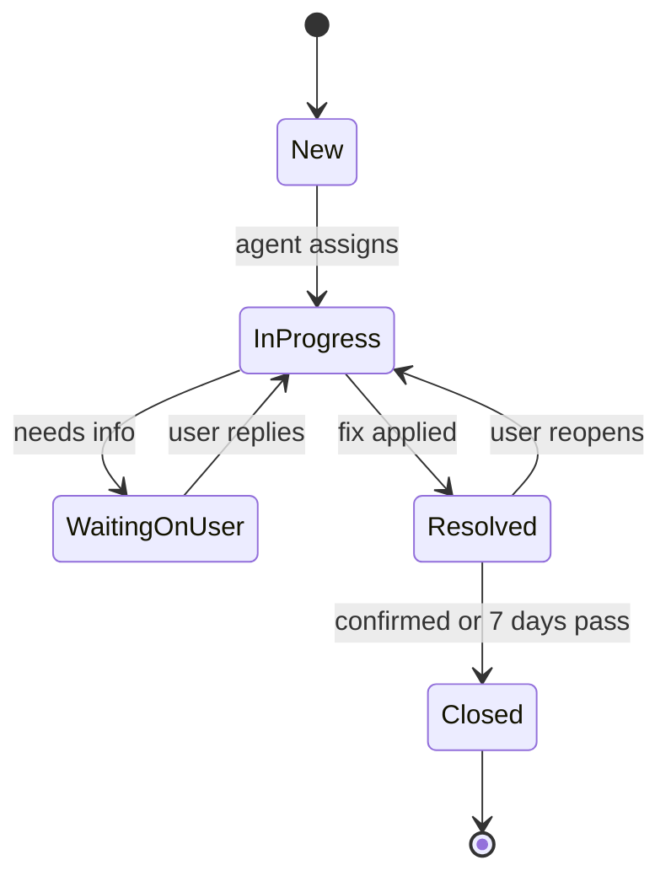

# Requirements

Each requirement has an ID so tasks, commits and tests can refer to it.

## 1. Users and roles

### Guests (employees)

- **FR-G1** Employees open tickets without an account or password.
- **FR-G2** After submitting, the guest sees the ticket number and a private tracking link, with a copy button and a QR code.
- **FR-G3** The tracking page shows status and public replies, and lets the guest reply or confirm the fix.
- **FR-G4** The tracking link opens that one ticket only. A guest who loses it asks IT; staff find the ticket by employee ID.
- **FR-G5** Guests never see internal notes.

### Staff (RBAC)

- **FR-R1** Only IT staff log in, with a username and password. There is no SSO.
- **FR-R2** Permissions are fixed in code. Root Admin creates roles and assigns permissions. Each staff member has one role.
- **FR-R3** The Go API checks the permission on every staff request. Hiding UI buttons is not a security control.

Default roles:

| Permission | Root Admin | Admin | Team Lead | Agent | Viewer |
| --- | --- | --- | --- | --- | --- |
| ticket.view_all | Yes | Yes | Yes | Yes | Yes |
| ticket.comment (public reply, internal note) | Yes | Yes | Yes | Yes | — |
| ticket.update (status, priority, category) | Yes | Yes | Yes | Yes | — |
| ticket.assign | Yes | Yes | Yes | Self only | — |
| report.view | Yes | Yes | Yes | — | Yes |
| audit.view (activity log) | Yes | Yes | Yes | — | — |
| category.manage (categories and locations) | Yes | Yes | Yes | — | — |
| staff.manage (deactivate, set role) | Yes | Yes | — | — | — |
| staff.create | Yes | — | — | — | — |
| role.manage | Yes | — | — | — | — |

Tickets are never deleted: there is no ticket.delete permission (dropped on 2026-09-29, migration 00005, because no feature used it). A ticket ends as Closed and stays in the history.

### Staff accounts

- **FR-A1** Only Root Admin creates staff accounts (name, username, temporary password, role). Staff have no email (notifications are in-app only). No self sign-up.
- **FR-A2** Login succeeds only for an active account with the right password. An unknown username, a wrong password and a deactivated account get the same answer, in about the same time.
- **FR-A3** staff.create and role.manage belong to Root Admin only and cannot be granted to any other role.
- **FR-A4** Admins cannot assign the Root Admin role.
- **FR-A5** The last active Root Admin cannot be deactivated or demoted.
- **FR-A6** The first Root Admin is created at install: `ticket-app create-root-admin --username <username>`. The command prints a generated temporary password once; there is no password flag, so it never lands in shell history.
- **FR-A7** Passwords: 12 to 128 characters, no composition rules (NIST 800-63B). Stored only as a PBKDF2-SHA256 hash (Go standard library, 600,000 iterations, 16-byte random salt).
- **FR-A8** A temporary password (new account or reset) must be changed at the next sign-in. Until then the API allows only reading the signed-in user, changing the password and signing out.
- **FR-A9** Staff change their own password (current password required). Only Root Admin resets another staff member's password, to a new temporary one.
- **FR-A10** A password change or reset ends every other session of that staff member.
- **FR-A11** Login rate limit, counted in Redis: after 5 failed attempts for a username, or 20 from one IP, within 15 minutes, further attempts get 429 until the window ends.

Usernames: 3 to 64 characters from `a-z 0-9 . _ - @`, unique, compared in lower case.

## 2. Tickets

### Guest form fields

| Field | Rule |
| --- | --- |
| Guest name | Required, up to 100 characters |
| Employee ID | Required, up to 20 characters |
| Building | Required, dropdown |
| Floor | Required, dropdown filtered by building |
| Line | Required, dropdown filtered by floor |
| Case details | Required, 10 to 5,000 characters |
| Evidence | Optional, up to 5 files |

- **FR-T1** Evidence: images (JPEG, PNG, HEIC) up to 10 MB each; videos (MP4, MOV) up to 100 MB each. Phones can capture straight from the form.
- **FR-T2** Summary = first 80 characters of case details, shown in the queue.
- **FR-T3** Staff set category and priority at triage. Guests do not.
- **FR-T4** No email is collected from guests.

### Staff-set fields

| Field | Values |
| --- | --- |
| Category | Admin-managed list (default: Hardware, Software, Network, Access, Other) |
| Priority | Low, Medium, High, Urgent |
| Status | New, In Progress, Waiting on User, Resolved, Closed |
| Assignee | A staff member |

### Lifecycle

- **FR-T5** A Resolved ticket closes when the guest confirms, or automatically after 7 days (actor "system"). The diagram is the usual path, not a limit: staff with ticket.update may set any status, including Closed, and may reopen a Closed ticket.
- **FR-T6** Replies are either public (guest sees) or internal notes (staff only).

## 3. Pages

Guest (no login):

1. Welcome page (`/`) with one way in to the form
2. New ticket form (`/report`)
3. Tracking page (from private link)

Staff (username and password):

1. Login, and change password (forced after a temporary password)
2. Queue — filter by status, priority, assignee; search by employee ID
3. Ticket detail — replies, internal notes, timeline, attachments
4. Reports — live dashboard, PDF export
5. Admin — staff accounts, roles, categories, buildings / floors / lines
6. Activity log — filter by staff, action, ticket, date; PDF export

## 4. Activity log

- **FR-L1** Every action below is written to `audit_log` in the same DB transaction as the change.
- **FR-L2** Append-only: the app DB user has INSERT and SELECT on `audit_log`, no UPDATE or DELETE.
- **FR-L3** Each ticket shows its own timeline (who moved it to In Progress, who closed it).
- **FR-L4** Retention: 2 years, then archive (to confirm).

| Action | Details recorded |
| --- | --- |
| ticket.created | Guest employee ID, location |
| ticket.status_changed | Who, old and new status |
| ticket.assigned | Who, old and new assignee |
| ticket.priority_changed, ticket.category_changed | Who, old and new value |
| ticket.auto_closed | Actor "system" |
| staff.created, staff.deactivated, staff.role_changed | Who, which account, old and new role |
| staff.password_changed, staff.password_reset | Who, which account, IP address (never the password) |
| role.changed | Who, permissions added and removed |
| report.exported | Who, filters used |
| login.success, login.failed | Username, IP address |

## 5. Reports

- **FR-P1** Staff with report.view see a live dashboard: summary cards, written summary, graphs.
- **FR-P2** Filters (date range, building, category) apply to the whole page.
- **FR-P3** Realtime updates via Server-Sent Events, no page refresh.
- **FR-P4** Export PDF downloads the current view as `tickets-report-YYYY-MM-DD.pdf`, with cards, summary, graphs and data tables.

Summary cards (each with change vs previous period; click opens filtered queue):
Open tickets · Unassigned · Urgent open · New · Resolved · First response (median) · Resolution time (median)

Written summary: fixed sentence templates (no AI), in the viewer's language.

| Graph | Type |
| --- | --- |
| Opened vs resolved per day | Line, 2 lines |
| Open by status | Doughnut |
| Open by priority | Bar |
| By category | Horizontal bar |
| By location (building → floor → line drill-down) | Horizontal bar |
| Staff workload, stacked by priority | Horizontal stacked bar |
| Weekly median first response and resolution | Line, 2 lines |

Every graph shows exact values on hover and has a "Show as table" toggle.

## 6. Languages

- **FR-I1** UI in English (en, default and fallback), Chinese Simplified (zh-CN), Burmese (my), Thai (th).
- **FR-I2** Language switcher on every page. First visit follows the browser; choice saved in a cookie and in the staff profile.
- **FR-I3** Statuses, priorities, permissions and API errors are codes, translated in the frontend.
- **FR-I4** Admin-entered names (categories, buildings, floors, lines) are stored in all 4 languages.
- **FR-I5** Dates and numbers use the browser `Intl` API.
- **FR-I6** Written summary, PDF export and activity log follow the viewer's language.
- **FR-I7** Case details and replies are stored as typed, not translated.
- **FR-I8** Burmese input in Zawgyi is detected and converted to Unicode before submit (myanmar-tools).
- **FR-I9** Fonts (Noto Sans, Noto Sans SC, Noto Sans Myanmar, Noto Sans Thai) are self-hosted.

## 7. Non-functional and security

- **NFR-1** HTTPS on every page.
- **NFR-2** Tracking tokens: 32 random bytes, stored only as SHA-256 hash, shown to the guest once.
- **NFR-3** Guest form rate limit: 5 tickets per IP per 10 minutes, counted in Redis.
- **NFR-4** Guest form reachable from the company network only (NGINX allow/deny).
- **NFR-5** Upload type checked from file content, not name; limits enforced in NGINX and the API.
- **NFR-6** PostgreSQL, Redis and Gotenberg reachable only inside the cluster; PostgreSQL and Redis require passwords.
- **NFR-7** All secrets in Vault; none in Git, images or CI variables.
- **NFR-8** Daily backups of database and uploads, with a tested restore.
- **NFR-9** Staff access ends at once when an admin deactivates the account in the app, or when Root Admin resets its password.
- **NFR-10** Only signed images from Harbor run in the cluster (Kyverno).
